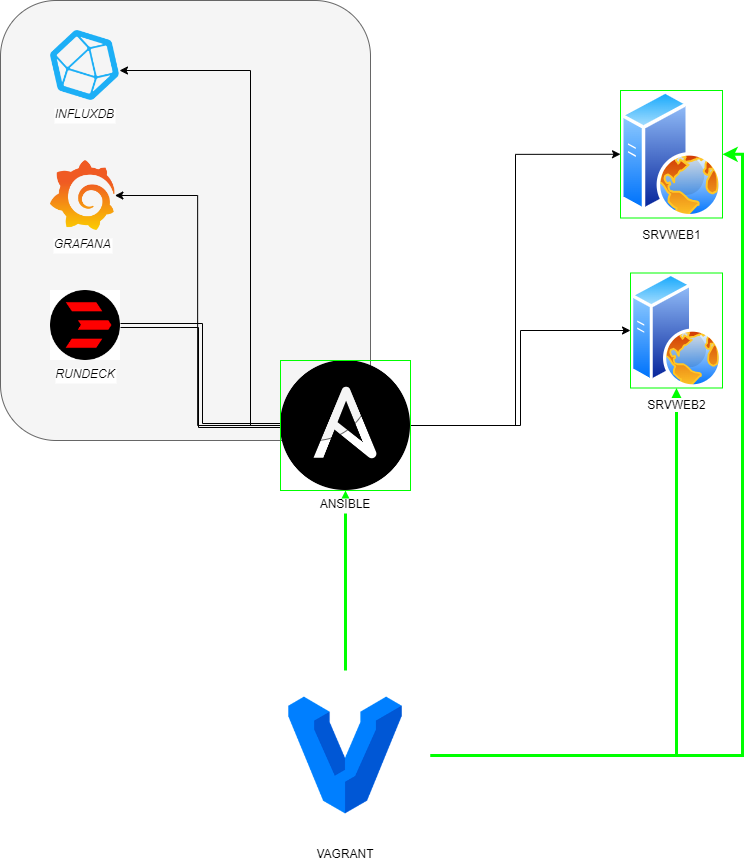

# PROJETO IFMT - MicroServices

## Integrantes do Trabalho

- Antonio Flavio
- Deivy Leão
- Kelsey Santos
- Jairo Pottratz
- Robert Santos

## Diagrama do Projeto


## Estrutura de Pastas
```
VG
│
├── ansible
│   ├── playbook-grafana.yml
│   ├── playbook-influx.yml
│   ├── playbook-plus.yml
│   └── playbook.yml
│
├── docker
│   └── docker-compose.yaml
│
├── rundeck
│   ├── data
│   └── projects
│
└── Vagrantfile
```
## Descrição
Este repositório contém configurações e scripts para implementação e gestão de um ambiente de monitoramento e automação utilizando as seguintes tecnologias:

## Ansible

Ansible é uma ferramenta de automação que permite gerenciar configurações e implantações de aplicativos em ambientes de infraestrutura.

### Utilização no Projeto

O Ansible está sendo utilizado para manipular dois servidores web, `srvweb1` e `srvweb2`, cujos IPs são, respectivamente, `10.0.0.11` e `10.0.0.12`. O endereço IP do servidor Ansible é `10.0.0.10`.

## InfluxDB

InfluxDB é um banco de dados de séries temporais otimizado para armazenamento e recuperação de dados de métricas e eventos em tempo real.

### Utilização no Projeto

O InfluxDB está sendo utilizado para armazenar métricas de memória e processador coletadas dos servidores web gerenciados pelo Ansible.

## Grafana

Grafana é uma plataforma de análise e visualização de métricas que permite criar dashboards personalizados para monitorar dados de várias fontes.

### Utilização no Projeto

O Grafana está sendo utilizado para visualizar e analisar as métricas armazenadas no InfluxDB, permitindo monitoramento em tempo real do desempenho dos servidores web.

## Rundeck

Rundeck é uma plataforma de automação de operações que permite executar tarefas automatizadas em diversos servidores.

### Utilização no Projeto

O Rundeck está sendo utilizado para gerenciar e agendar tarefas automatizadas, além de integrar com outras ferramentas como o Grafana para execução de ações com base em métricas monitoradas.

## Arquivos de Configuração

Além das descrições acima, este repositório contém os seguintes arquivos de configuração:

- `Vagrantfile`: Configuração do ambiente de virtualização usando Vagrant.
- `inventory.ini`: Arquivo de inventário do Ansible para definição de hosts.
- `playbook-influxdb.yml`: Playbook do Ansible para configuração do InfluxDB e coleta de métricas.
- `playbook-grafana.yml`: Playbook do Ansible para configuração do Grafana e criação de dashboard.
- `docker-compose.yml`: Configuração do Docker Compose para criação dos contêineres do Grafana, InfluxDB e Rundeck.


